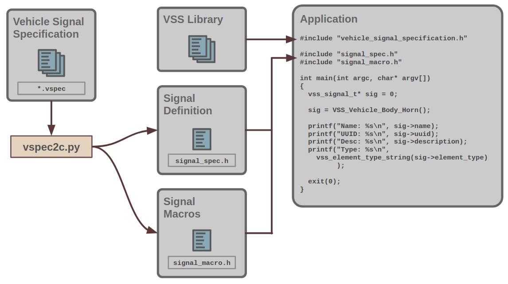

# ENCODE  A VEHICLE SIGNAL SPECIFICATION IN C

**(C) 2019 Jaguar Land Rover**

The vspec2c tooling allows a vehicle signal specification to be
translated from its source YAML file to native C code that
has the entire specification encoded in it.

The specification is encoded as two header files, one hosting a struct
array with all signal specification data, and one with a set of macros
to access signals.

The two header files are included by the application, which is then
linked with the vehicle signal specification built in this repo.

Please see the schematics below for details.

The example `signal_spec.h` file contains an array of `vss_signal_t`
structs, each element defining one signal.

**NOTE**: `signal_spec.h` containing global definitions, should only be included by
a single source file in a project. If it is included multiple times, the
linker will failed with multiple defintions of `vss_signal` and other symbols. 
`signak_macro.h` can be included by all source file that needs a macro reference to 
specific signals

There is also a sha256 signature for the specification as a whole,
which can be used by an application to ensure that the correct vehicle
signal specification is being used.

## Building the VSS C library
To build the library providing the `vss_...` functions used to inspect the signal specification, run:

    make

The build process generates `libvss.so` and `libvss.a`, to be linked
by the appliction.

## Installing the VSS C library
To install the built vss library and header files under /usr/local, run:

    make install

You can specify an alternate destination directory through the
`DESTDIR` environment variable:

    DESTDIR=/usr make install

## Building the vss_dump demo
The demo can be built by changing into the example directory and run
make:

    cd example
    make

The `vspec2.py` is executed to read the spec file and generate the
`signal_spec.h` and `signal_macro.h` files. Please see the top-level
`README.md` file for this repo for details on spec files, id files,
and other aspects of the signal specifictaion toolkit.

## Running the demo
The vss_dump demo, which prints out the entire vehicle signal spec on
screen, can be run from the example directory via:

    ./vss_dump
