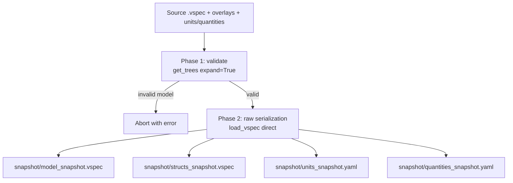

# compose

## What it does

A vspec model is typically spread across many files: a main `.vspec`, optional `#include` files, overlays, a units file, and a quantities file. `vspec compose` collapses all of that into a single **self-contained folder** (a _snapshot_) that any downstream `vspec export` command can consume without needing the original source tree.

```
vspec compose \
  -u units.yaml \
  -q quantities.yaml \
  -s spec/Vehicle.vspec \
  -l my_overlay.vspec \
  --types types.vspec \
  -o snapshot/
```

The output folder contains up to four files:

| File | Contains | Always written? |
|---|---|---|
| `model_snapshot.vspec` | The full model tree | Yes |
| `structs_snapshot.vspec` | Custom struct type definitions | Only when `--types` is given |
| `units_snapshot.yaml` | Resolved units | Only when units are provided |
| `quantities_snapshot.yaml` | Resolved quantities | Only when quantities are provided |

## How it works



**Phase 1 — Validation.** The full model is loaded with expansion enabled. All Pydantic type checks, unit validation, naming conventions, and structural rules run normally. If anything is wrong the command aborts with a clear error — the snapshot is never written.

**Phase 2 — Faithful serialization.** The raw authored YAML is read directly (without tree-building) and written as-is. This means:

- `instances` fields are preserved — the snapshot is not pre-expanded.
- Instance-level overrides (e.g. `Door.Row1.Left.IsOpen`) written in the source are kept exactly as authored.
- Only internal runtime fields (`delete`, `fqn`, `is_instance`) are stripped.
- No default values are injected — what you wrote is what you get.

## Using the snapshot

The primary use of such a snapshot could be a released artifact to complement the versioning and evolution of a domain data model.
Once the snapshot is taken, it becomes an inmutable reference.
Then, it becomes easier to report differences between two snapshopts.
See [diff command](./diff.md).

Because the snapshot is valid vspec, it feeds directly into any exporter:

```bash
vspec export json \
  -u snapshot/units_snapshot.yaml \
  -q snapshot/quantities_snapshot.yaml \
  -s snapshot/model_snapshot.vspec \
  --types snapshot/structs_snapshot.vspec \
  -o output.json
```

This also means the snapshot round-trips cleanly: composing a snapshot of a snapshot produces identical output.