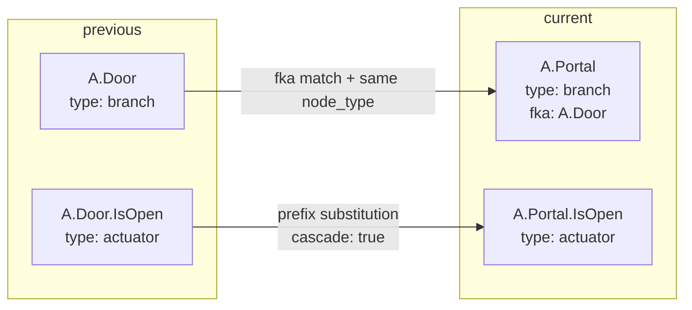
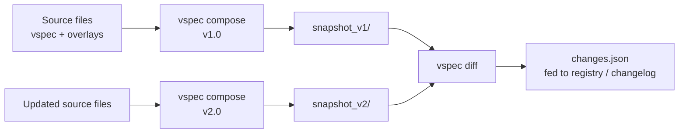

# diff

## What it does

`vspec diff` compares two snapshots produced by `vspec compose` and reports every change as a structured JSON document. It is the foundation for tracking model evolution, generating changelogs, and feeding a spec registry.

```bash
vspec diff -p snapshot_v1/ -c snapshot_v2/
# or write to file:
vspec diff -p snapshot_v1/ -c snapshot_v2/ -o changes.json
```

## Output structure

```json
{
  "previous": "snapshot_v1/",
  "current":  "snapshot_v2/",
  "summary": { "ADDED": 2, "REMOVED": 1, "MODIFIED": 3 },
  "changes": [ ... ]
}
```

Each entry in `changes` has:

| Field | Always present | Description |
|---|---|---|
| `type` | Yes | `ADDED`, `REMOVED`, or `MODIFIED` |
| `source` | Yes | `model`, `structs`, `units`, or `quantities` |
| `path` | Yes | FQN of the node in the **current** snapshot |
| `node_type` | Yes | e.g. `branch`, `sensor`, `actuator` |
| `message` | Yes | Human-readable description of the change |
| `previous_path` | MODIFIED renames only | FQN in the previous snapshot |
| `cascade` | MODIFIED renames only | `true` if this is a child of a renamed branch |
| `attribute_changes` | MODIFIED only | List of `{attribute, previous, current}` dicts |
| `attributes` | ADDED only | Full attribute dict of the new node |

## Change types

**ADDED** — a node exists in current but not in previous.

**REMOVED** — a node exists in previous but not in current.

**MODIFIED** — a node exists in both, but something changed. This covers:
- attribute value changes (datatype, unit, description, etc.)
- renames detected via the `fka` ("formerly known as") field

## Rename detection

Renames are detected automatically without requiring any extra flags.



1. **Explicit rename** — if an added node has `fka: [old.path]` and the same `type` as the removed node, it is reported as `MODIFIED` with `previous_path`.
2. **Cascade** — children of a renamed branch are matched by FQN prefix substitution. Each cascaded child is independently checked for attribute changes too.

If `fka` is missing, or the node type doesn't match, the pair is reported as independent `REMOVED` + `ADDED`.

## Example output

```json
{
  "type": "MODIFIED",
  "source": "model",
  "path": "A.Portal",
  "previous_path": "A.Door",
  "node_type": "branch",
  "cascade": false,
  "attribute_changes": [],
  "message": "Branch 'A.Door' was renamed to 'A.Portal'."
},
{
  "type": "MODIFIED",
  "source": "model",
  "path": "A.Portal.IsOpen",
  "previous_path": "A.Door.IsOpen",
  "node_type": "actuator",
  "cascade": true,
  "attribute_changes": [
    { "attribute": "datatype", "previous": "boolean", "current": "string" }
  ],
  "message": "Actuator 'A.Door.IsOpen' was renamed to 'A.Portal.IsOpen' (cascaded from parent rename). Attribute 'datatype' changed from 'boolean' to 'string'."
}
```

## Typical workflow



## About braking changes
The `diff` command is intentionally reporting ANY change without dictating what constitudes a braking chage.
That distinction is to be handle elsewhere based on the diff report.