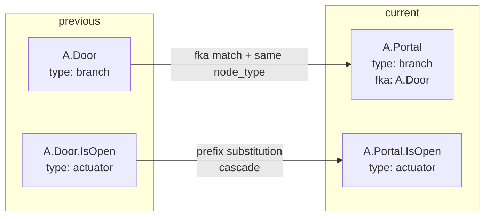
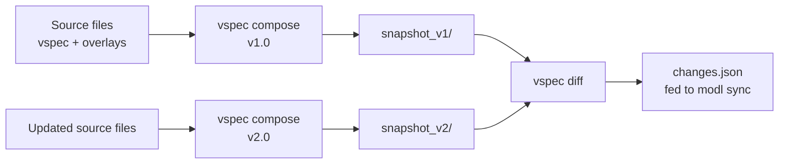

# diff

## What it does

`vspec diff` compares two snapshots produced by `vspec compose` and reports every change as a
structured JSON document in [modl](https://github.com/COVESA/modl)'s adapter intermediate
representation (IR) — ready to be fed straight into `modl sync --diff-report`.

```bash
vspec diff -p snapshot_v1/ -c snapshot_v2/
# or write to file:
vspec diff -p snapshot_v1/ -c snapshot_v2/ -o changes.json
# first-run mode (no previous snapshot): every element is reported as ADDED
vspec diff -c snapshot_v1/
```

## Output structure

```json
{
  "previous": "snapshot_v1/",
  "current":  "snapshot_v2/",
  "changes":  [ ... ]
}
```

Each entry in `changes` is a modl IR event. Fields present depend on `kind` and `change_type`:

| Field | Present when | Description |
|---|---|---|
| `label` | always | FQN of the element in the **current** snapshot (or the pre-removal FQN on `REMOVED`). |
| `kind` | always | `ENTITY`, `PROPERTY`, `ENUMERATION_SET`, or `ENUM_VALUE` (see [Kind mapping](#kind-mapping)). |
| `change_type` | always | `ADDED`, `REMOVED`, or `MODIFIED`. |
| `parent_label` | `PROPERTY`/`ENUM_VALUE`, and nested `ENTITY` | Immediate parent's label. |
| `renamed_from` | `MODIFIED` renames only | FQN in the previous snapshot. |
| `aspects` | `ADDED`/`MODIFIED` | Full snapshot on `ADDED`; changed-keys-only delta on `MODIFIED`, each value wrapped with `_op` (see [Aspect wrapping](#aspect-wrapping-on-modified-events)). Empty `{}` on `REMOVED`. |
| `previous_aspects` | `REMOVED` only | Full prior-state snapshot of the removed element — mandatory and non-empty. |
| `content` | `MODIFIED` `ENTITY`/`ENUMERATION_SET` | List of `{label, change_type}` summarising which children changed. |
| `is_leaf` | every `PROPERTY` event | `true` for a primitive/scalar property (binding-eligible); `false` when the property references another entity. Mandatory on every `PROPERTY` event (`ADDED`/`REMOVED`/`MODIFIED`), reflecting the current (or, on `REMOVED`, previous) state. Forbidden on `ENUM_VALUE`. See [is_leaf](#is_leaf). |

## Kind mapping

`vspec diff` maps VSS node types to modl IR kinds:

| VSS source | node `type` | modl `kind` |
|---|---|---|
| model / structs | `branch` / `struct` | `ENTITY` — and also `PROPERTY` if it has a parent, see [Branch duality](#branch-duality) |
| model / structs | any signal type (`sensor`, `actuator`, `attribute`) | `PROPERTY` |
| quantities | — | `ENUMERATION_SET` |
| units | — | `ENUM_VALUE` |

## Branch duality

VSS has no separate standalone-type layer: a branch's name is just its path segment, exactly like a
leaf signal's. This means a nested branch plays **two roles at once** — the same way a GraphQL field
like `cabin: Cabin` is both a `PROPERTY` on its parent type and a standalone `ENTITY`:

```graphql
type Vehicle {
  cabin: Cabin   # Vehicle.cabin is a PROPERTY of Vehicle, resolving to the Cabin ENTITY
  model: String  # Vehicle.model is a PROPERTY of Vehicle, resolving to a primitive
}
```

```yaml
Vehicle.Cabin:    # reported as BOTH an ENTITY (Cabin the container) ...
  type: branch    # ... AND a PROPERTY of Vehicle (Vehicle has-a Cabin)
```

Rule: every branch/struct that has a parent (i.e. its FQN contains a `.`) is reported as **both**:
- an `ENTITY` event, carrying its real attributes (`description`, `instances`, etc.), and
- a `PROPERTY` event with `parent_label` set to the immediate parent, carrying only
  `is_list` (`true` when the branch defines `instances`) and `is_required` — never `output_type`,
  since vspec branches have no standalone type to point to. This `PROPERTY` event always has
  `is_leaf: false`, since it references another entity (the branch/struct itself) rather than a
  primitive value.

Root-level branches (no parent, e.g. the top-level `Vehicle` branch) are reported as `ENTITY` only —
there is nothing for them to be "a field of".

On `MODIFIED`, both events are **always** emitted together, even when the change (e.g. a description
edit) has no property-relevant effect — in that case the `PROPERTY`-side event simply carries empty
`aspects: {}`. When the change is instance-relevant (instances added/removed), the `PROPERTY`-side
event carries a wrapped `is_list` delta if it flips between `true`/`false`.

## is_leaf

`is_leaf` is a first-class field on `PROPERTY` events — not an aspect — required by modl so it
knows which properties are eligible for binding generation: only leaf (primitive/scalar) properties
get bindings; properties that reference another entity never do.

It is derived with two rules:

1. **Branch/struct duality pointer events** (see [Branch duality](#branch-duality)) always get
   `is_leaf: false` — they represent a reference to another entity by construction.
2. **Real signals and struct members** get `is_leaf` based on whether their base `datatype`
   (stripped of any trailing `[]`) resolves to a known primitive VSS type. A `sensor`/`actuator`/
   `attribute` whose `datatype` names a struct (e.g. `datatype: VehicleDataTypes.MyStruct`) is
   `is_leaf: false`, even though it isn't a duality pointer itself:

```yaml
A.Speed:
  type: sensor
  datatype: float                          # primitive → is_leaf: true

A.RichSensor:
  type: sensor
  datatype: VehicleDataTypes.MyStruct      # struct reference → is_leaf: false
```

`is_leaf` is never present on `ENUM_VALUE` events.

## Aspect wrapping on MODIFIED events

Every changed key in a `MODIFIED` event's `aspects` is wrapped with an `_op` annotation, per the modl
IR contract:

```json
"aspects": {
  "unit":        { "_op": "added",    "_value": "mph" },
  "accuracy":    { "_op": "removed",  "_previous": 0.5 },
  "description": { "_op": "modified", "_value": "new text", "_previous": "old text" }
}
```

The two exceptions are the directional instance-list keys, which stay as plain unwrapped arrays since
they carry a delta rather than a single old/new pair:

```json
"aspects": { "instances_added": ["Center"], "instances_removed": ["Row3"] }
```

## Change types

**ADDED** — a node exists in current but not in previous. `aspects` carries the full attribute
snapshot.

**REMOVED** — a node exists in previous but not in current. `aspects` is empty; `previous_aspects`
carries the full attribute snapshot as it existed before removal.

**MODIFIED** — a node exists in both, but something changed. This covers:
- attribute value changes (datatype, unit, description, etc.) — wrapped with `_op`
- instance list changes — reported as `instances_added`/`instances_removed` deltas
- renames detected via the `fka` ("formerly known as") field — reported via `renamed_from`

## Rename detection

Renames are detected automatically without requiring any extra flags.


```mermaid
flowchart LR
    subgraph previous
        A[A.Door\ntype: branch]
        B[A.Door.IsOpen\ntype: actuator]
    end
    subgraph current
        C["A.Portal\ntype: branch\nfka: A.Door"]
        D[A.Portal.IsOpen\ntype: actuator]
    end
    A -- "fka match + same node_type" --> C
    B -- "prefix substitution\ncascade" --> D
```

1. **Explicit rename** — if an added node has `fka: [old.path]` and the same `type` as the removed
   node, it is reported as `MODIFIED` with `renamed_from`.
2. **Cascade** — children of a renamed branch are matched by FQN prefix substitution. Each cascaded
   child is independently checked for attribute changes too.

If `fka` is missing, or the node type doesn't match, the pair is reported as independent `REMOVED` +
`ADDED`.

## Example output

```json
{
  "label": "A.Portal",
  "kind": "ENTITY",
  "change_type": "MODIFIED",
  "parent_label": "A",
  "renamed_from": "A.Door",
  "aspects": {},
  "content": [
    { "label": "A.Portal.IsOpen", "change_type": "MODIFIED" }
  ]
},
{
  "label": "A.Portal",
  "kind": "PROPERTY",
  "parent_label": "A",
  "change_type": "MODIFIED",
  "renamed_from": "A.Door",
  "aspects": {},
  "is_leaf": false
},
{
  "label": "A.Portal.IsOpen",
  "kind": "PROPERTY",
  "parent_label": "A.Portal",
  "change_type": "MODIFIED",
  "renamed_from": "A.Door.IsOpen",
  "aspects": {
    "output_type": { "_op": "modified", "_value": "string", "_previous": "boolean" }
  },
  "is_leaf": true
}
```

The `A.Portal` branch rename produces both its `ENTITY` event (with `content` summarising its
changed child) and its `PROPERTY` event (since it has a parent, `A`) — per [Branch duality](#branch-duality).

## Typical workflow


```mermaid
flowchart LR
    S[Source files\nvspec + overlays] --> C1[vspec compose\nv1.0]
    S2[Updated source files] --> C2[vspec compose\nv2.0]
    C1 --> SN1[snapshot_v1/]
    C2 --> SN2[snapshot_v2/]
    SN1 --> D[vspec diff]
    SN2 --> D
    D --> J[changes.json\nfed to modl sync]
```

## About breaking changes
The `diff` command is intentionally reporting ANY change without dictating what constitutes a
breaking change. That distinction is handled downstream by `modl sync`'s breaking-change
configuration.
