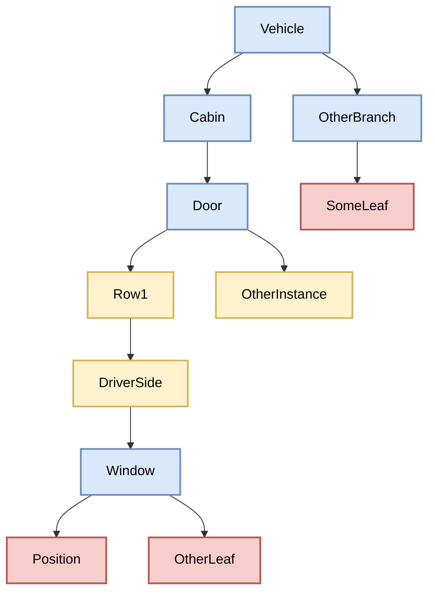
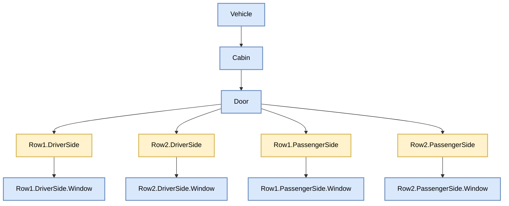

# GraphQL Exporter

> **Note**: This GraphQL exporter is being evaluated for potential deprecation or rework. **Why deprecation?** This exporter generates a GraphQL schema that resambles the Vspec tree. It was not designed to serve directly a GraphQL API, but for migrating the information of Vspec files to the GraphQL Schema Definition Language (SDL). It uses graphene package which relies on classes to create elements, whereas in the logic the classes are dynamically generated. Also, since graphene is an abstraction of the graphql-core implementation, some modifications were not easily achievable. Hence, a more sophisticated [Simplified Semantic Data Modeling (S2DM) exporter](s2dm.md) was created for this purpose. **Why rework?** It might still make sense to keep this exporter and refactor it to produce an output file that enables a proper GraphQL API.

This exporter generates a valid GraphQL schema out of the VSS specification.
The schema is constructed according to the [GraphQL Schema Language](https://graphql.org/learn/schema/) and is designed for traditional GraphQL API usage patterns.

## VSS to GraphQL Mapping
### VSS elements in a nutshell
VSS resembles a hierarchical tree, where a concept of interest is a node in it.
The actual data point appears always as a `leaf` in the tree (i.e., one of type `attribute`, `sensor`, or `actuator`).
The context for those `leaf` nodes is implicitly captured by grouping them under particular `branch` nodes.
For example, in the following diagram, the window position results in the name `Vehicle.Cabin.Door.Row1.DriverSide.Window.Position`. Here, `Row1.DriverSide` refers to a particular instance of the concept `Door`.


### VSS metadata
The following table shows the possible metadata for VSS elements:
| VSS metadata item    | Description                                | Mandatory? | In `branch`? | In `leaf`? |
|--------------|--------------------------------------------|------------|--------------|------------|
| `fqn`        | Fully qualified name of the element (aka., VSS `Signal`)        | Yes        | Yes          | Yes        |
| `type`       | One of `branch`, `attribute`, `sensor`, or `actuator` | Yes        | Yes          | Yes        |
| `description`| Description of the element                 | Yes        | Yes          | Yes        |
| `comment`    | Additional comments about the element      | No         | Yes          | Yes        |
| `deprecation`| Deprecation status of the element          | No         | Yes          | Yes        |
| `instances`  | Labels identifying multiple occurrences    | No         | Yes          | No         |
| `datatype`   | Data type of the leaf element              | Yes        | No           | Yes        |
| `unit`       | Unit of measurement for the leaf element   | No         | No           | Yes        |
| `min`        | Minimum value for the leaf element         | No         | No           | Yes        |
| `max`        | Maximum value for the leaf element         | No         | No           | Yes        |
| `allowed`    | Allowed values for the leaf element        | No         | No           | Yes        |
| `default`    | Default value for the leaf element         | No         | No           | Yes        |


### Mapping rules for VSS `branch` nodes
* `fqn`
  * The `fqn` is used to construct the name of a GraphQL `type`.
* `type: branch`
  * We distiguish a pure VSS `branch` from those that are `instances`. The aim is to focus the modeling process only on the abstract concepts that capture the intended meaning without repetition of entries.
  * Only if the `branch` is not an instance of another branch, a `GraphQL type` whith name based on the `fqn` is created.
* `description`
  * A doc string above the GraphQL `type` definition.
* `comment`
  * Included in the doc string with the prefix `@comment`.
* `deprecation`
  * Using the GraphQL `@deprecated` directive.
* `instances`
  * An `instance:` GraphQL `field` is created inside the `type` definition. This field points to a particular `enum`.
  * A GraphQL `enum` named as `<instantiatedBranchName>InstanceEnum` is created with the values specified in the vspec.
  * The parent node to which the instantiatable branch belongs will contain a field for that in the **plural** form. Also, the assotiated type for the value is created as an array to indicate the possibility of having multiple instances of such an element. For example, if the type `Cabin` is expected to have multiple doors, then a field `doors: [Door]` will appear there.

#### Example in vspec
For example, considering the concepts `Vehicle`, `Cabin`, `Door`, and `Window`.
They are specified in `vspec` as follows:
```yaml
Vehicle:
  description: High-level vehicle data.
  type: branch

Vehicle.Cabin:
  description: All in-cabin components, including doors.
  type: branch

Vehicle.Cabin.Door:
  type: branch
  instances:
    - Row[1,2]
    - ["DriverSide","PassengerSide"]
  description: All doors, including windows and switches.

Vehicle.Cabin.Door.Window:
  type: branch
  description: Door window status. Start position for Window is Closed.
```
If we directly expand the tree, it will result in unnecessary repetition of the specification for the instantiated branches.



<details>

<summary>Click here to expand an example YAML export</summary>

#### Example of repeated concepts in the yaml export.

```yaml
Vehicle:
  description: High-level vehicle data.
  type: branch

Vehicle.Cabin:
  description: All in-cabin components, including doors.
  type: branch

Vehicle.Cabin.Door:
  description: All doors, including windows and switches.
  type: branch

Vehicle.Cabin.Door.Row1:
  description: All doors, including windows and switches.
  type: branch

Vehicle.Cabin.Door.Row1.DriverSide:
  description: All doors, including windows and switches.
  type: branch

Vehicle.Cabin.Door.Row1.DriverSide.Window:
  description: Door window status. Start position for Window is Closed.
  type: branch

Vehicle.Cabin.Door.Row1:
  description: All doors, including windows and switches.
  type: branch

Vehicle.Cabin.Door.Row1.DriverSide:
  description: All doors, including windows and switches.
  type: branch

Vehicle.Cabin.Door.Row1.DriverSide.Window:
  description: Door window status. Start position for Window is Closed.
  type: branch

Vehicle.Cabin.Door.Row2:
  description: All doors, including windows and switches.
  type: branch

Vehicle.Cabin.Door.Row2.DriverSide:
  description: All doors, including windows and switches.
  type: branch

Vehicle.Cabin.Door.Row2.DriverSide.Window:
  description: Door window status. Start position for Window is Closed.
  type: branch
```

</details>


#### Example in GraphQL.


To convey the same information in a compact way, the GraphQL correspondance would be:
```graphql
"""All in-cabin components, including doors."""
type Cabin {
    doors: [Door]
}

"""All doors, including windows and switches."""
type Door {
    instanceLabel: doorInstanceEnum
    window: Window
}

"""Door window status. Start position for Window is Closed."""
type Window {
    ...
}

"""Set of possible values for the instance name of a Door."""
type doorInstanceEnum {
    ROW1_DRIVERSIDE
    ROW1_PASSENGERSIDE
    ROW2_DRIVERSIDE
    ROW2_PASSENGERSIDE
}
```

### Mapping rules for VSS `leaf` nodes
* `fqn`
  * The last part of the `fqn` (i.e., the node's name itself) becomes the name of a GraphQL `field` inside a particular GraphQL `type`.
* `type`
  * Since GraphQL specifies a contract between the data producer and data consumer. The specified data can be made readable (via `Query`) and/or writtable (via `Mutation`).
  * Optional: Regardless of the `VSS type`, every leaf can have a field in a `Query` to indicate that the value can be read. This is listed as optional because some concepts might not be desired to be queried atomically.
  * Optional: If `VSS type` is `actuator`, a `Mutation` for that concept could be specified. This is listed as optional because some concepts might not be desired to be modifiable atomically.
* `description`
  * A doc string above the `GraphQL field` definition.
* `comment`
  * Included in the doc string with the prefix `@comment`.
* `deprecation`
  * Using the GraphQL `@deprecated` directive.
* `datatype`
  * Using the built-in `scalar`.
  * Custom `scalar` are also provided to cover other datatypes.
* `unit`
  * Used as an attribute in a particular `GraphQL field`
* `min`
  * Added as info to the doc string `@min:`.
* `max`
  * Added as info to the doc string `@max:`.
* `allowed`
  * A `GraphQL Enum` is created to hold the set of possible values expected for that `GraphQL Field`
* `default`
  * Added as info to the doc string as `@default:`.


#### Example in vspec
Considering the `Position` and `Switch` properties of the `Row1.DriverSide.Window`, its specification looks like:
```yaml
Vehicle.Cabin.Door.Row1.DriverSide.Window.Position:
  comment: Relationship between Open/Close and Start/End position is item dependent.
  datatype: uint8
  description: Item position. 0 = Start position 100 = End position.
  max: 100
  min: 0
  type: actuator
  unit: percent

Vehicle.Cabin.Door.Row1.DriverSide.Window.Switch:
  allowed:
  - INACTIVE
  - CLOSE
  - OPEN
  - ONE_SHOT_CLOSE
  - ONE_SHOT_OPEN
  datatype: string
  description: Switch controlling sliding action such as window, sunroof, or blind.
  type: actuator
```

#### Example in GraphQL
```graphql
"""Door window status. Start position for Window is Closed."""
type Window {
  """
  Item position. 0 = Start position 100 = End position.
  @comment: Relationship between Open/Close and Start/End position is item dependent.
  @min: 0
  @max: 100
  """
  position(unit: RelationUnit = PERCENT): UInt8

  """
  Switch controlling sliding action such as window, sunroof, or blind.
  """
  switch: WindowSwitchEnum
}

enum WindowSwitchEnum {
  INACTIVE
  CLOSE
  OPEN
  ONE_SHOT_CLOSE
  ONE_SHOT_OPEN
}
```

### Mapping references
The exporter has the option to save the mapping references to a `.json` file by using the `--legacy-mapping-output`. For example:
```shell
vspec export graphql --vspec path_to_spec.vspec --output path_to_output_schema.graphql --legacy-mapping-output path_to_mapping_file.json
```

The mapping reference file will look like follows:
```json
{
    "quantity_kinds_and_units": {
        "info": "Mappings of vspec quantity kind and their units to the corresponding names in GraphQL.",
        "mappings": {
            "acceleration": {
                "gql_unit_enum": "AccelerationUnit_Enum",
                "units": {
                    "centimeters per second squared": "CENTIMETERS_PER_SECOND_SQUARED",
                    "meters per second squared": "METERS_PER_SECOND_SQUARED"
                }
            },
            ...
        },
    },

    "vspec_branches": {
        "info": "Mappings of vspec branches to the corresponding names in GraphQL.",
        "mappings": {
          "Vehicle.Body.Lights.Beam": {
                "gql_type": "Vehicle_Body_Lights_Beam",
                "gql_instance_enum": "Vehicle_Body_Lights_Beam_Instance_Enum",
                "instance_labels": {
                    "Low": "LOW",
                    "High": "HIGH"
                }
            },
            ...
        },
    },

    "vspec_leaves": {
        "info": "Mappings of vspec leaves to the corresponding names in GraphQL.",
        "mappings": {
          "Vehicle.ADAS.ActiveAutonomyLevel": {
                "gql_field": "activeAutonomyLevel",
                "in_gql_type": "Vehicle_ADAS",
                "gql_allowed_enum": "Vehicle_ADAS_ActiveAutonomyLevel_Enum",
                "allowed_values": {
                    "SAE_0": "SAE_0",
                    "SAE_1": "SAE_1",
                    "SAE_2_DISENGAGING": "SAE_2_DISENGAGING",
                    "SAE_2": "SAE_2",
                    "SAE_3_DISENGAGING": "SAE_3_DISENGAGING",
                    "SAE_3": "SAE_3",
                    "SAE_4_DISENGAGING": "SAE_4_DISENGAGING",
                    "SAE_4": "SAE_4",
                    "SAE_5_DISENGAGING": "SAE_5_DISENGAGING",
                    "SAE_5": "SAE_5"
                }
            },
          ...
        }
```

## GraphQL vs S2DM Exporters

VSS-tools provides two GraphQL-related exporters that serve different purposes:

### Traditional GraphQL Exporter (this document)
- **Purpose**: Generate schemas optimized for GraphQL APIs and runtime query execution
- **Target Use Case**: Building GraphQL servers, client applications, and API endpoints
- **Schema Design**: Focuses on query efficiency and typical GraphQL patterns
- **Directives**: Minimal use of custom directives
- **Traceability**: Limited mapping information available via optional JSON output

### S2DM Exporter ([see S2DM documentation](s2dm.md))
- **Purpose**: Generate schemas for semantic data modeling with comprehensive VSS traceability
- **Target Use Case**: Code generation, documentation, data modeling, and cross-platform integration
- **Schema Design**: Preserves VSS structure and metadata extensively
- **Directives**: Comprehensive `@vspec` directives on every schema element
- **Traceability**: Complete bidirectional mapping between GraphQL schema and VSS specification

### Choosing the Right Exporter

- **Use the GraphQL exporter** when building traditional GraphQL APIs, servers, or client applications that need to query VSS data efficiently
- **Use the S2DM exporter** when you need comprehensive traceability, code generation, documentation, or integration with semantic data modeling tools

Both exporters produce valid GraphQL SDL, but they optimize for different use cases and integration patterns.
          ...
        }


```